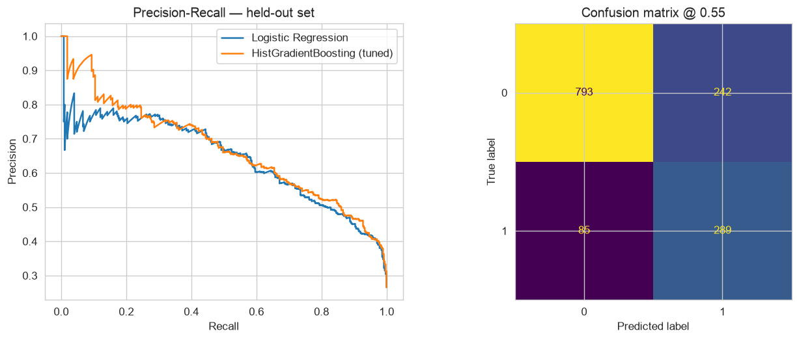
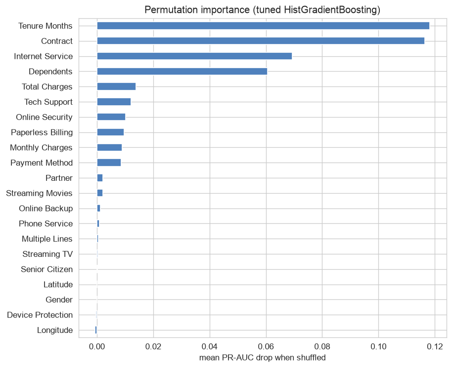
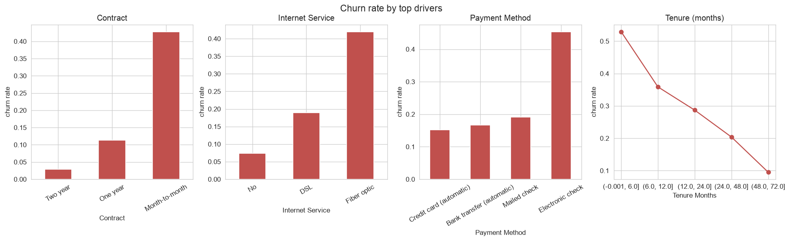
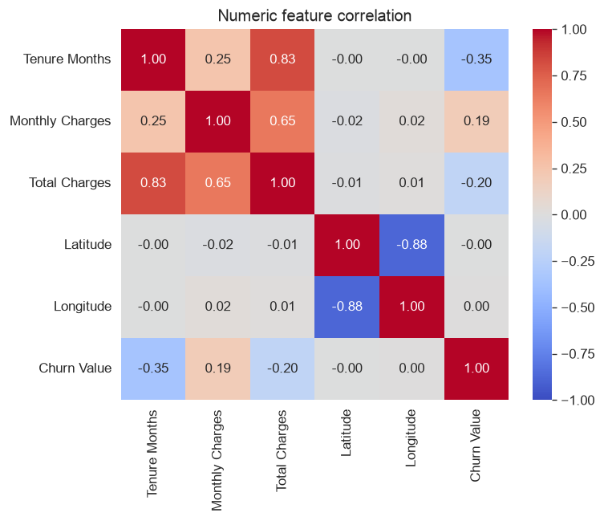

# Customer Churn Prediction

Predicting which telecom customers will leave, using the IBM Telco Customer Churn dataset.
The project covers the full path from raw data to a tuned, evaluated model: exploratory analysis,
a leakage-safe preprocessing pipeline, a versioned clean dataset, and two models compared on
held-out data.

**Dataset:** [Telco customer churn (IBM)](https://www.kaggle.com/datasets/yeanzc/telco-customer-churn-ibm-dataset)
— 7,043 customers, 33 columns, 26.5% churn.

---

## Results

| model | CV PR-AUC | test PR-AUC | test ROC-AUC | recall @ 0.55 | precision @ 0.55 |
|---|---|---|---|---|---|
| Logistic Regression (baseline) | 0.678 | 0.643 | 0.848 | 0.74 | 0.54 |
| HistGradientBoosting (tuned) | **0.679** | **0.669** | **0.856** | **0.77** | 0.55 |

At the chosen operating threshold the model **catches 77% of churners at 55% precision**.
Gradient boosting edges the linear baseline by ~2.6 PR-AUC points — the churn signal is mostly
linear and additive, so both models tell the same story.



---

## What drives churn

Permutation importance on the held-out set, and it agrees with the EDA:



1. **Tenure** — 53% churn in the first 6 months vs 9% after 4 years
2. **Contract** — month-to-month churns ~15x more than two-year
3. **Internet Service** — fiber-optic customers churn more, tracking their higher bill (not the tech)
4. **Dependents** — customers with dependents rarely leave

`Latitude` / `Longitude`, `Gender`, `Phone Service`, streaming, and `Senior Citizen` contribute
essentially nothing.



`Total Charges` is ≈ `Tenure Months × Monthly Charges` (r ≈ 0.99) — collinear, keep only one for a
linear model:



---

## Pipeline

```
raw_data/Telco_customer_churn.xlsx
        │  python -m scripts.prepare_data
        │  (drop 11 leakage/ID/constant columns · coerce Total Charges · collapse
        │   "No internet service"/"No phone service" → "No")
        ▼
processed_data/telco_churn_clean.csv          ← versioned input for the model
        │  src.model.build_pipeline()
        │  ColumnTransformer (scale + encode, fit on train folds only) → classifier
        ▼
   StratifiedKFold CV → RandomizedSearchCV → held-out evaluation at a chosen threshold
```

Stateless cleaning runs once in `src/data.py`. Everything that learns from data (scaling, one-hot
categories) lives inside the sklearn `Pipeline`, so it is refit within every CV fold — no leakage
during tuning.

---

## Setup

```bash
python -m venv .venv
source .venv/bin/activate
pip install -r requirements.txt
```

## Run

```bash
python -m scripts.prepare_data      # raw_data/*.xlsx  → processed_data/telco_churn_clean.csv
python -m scripts.make_figures      # regenerate assets/*.png
jupyter lab notebook/               # 01_EDA.ipynb, 02_modeling.ipynb
```

Notebooks use the kernel **"Python (customer-churn .venv)"** (registered by
`python -m ipykernel install --user --name customer-churn`).

---

## Repository layout

```
raw_data/            source workbook
processed_data/      generated clean CSV (versioned)
assets/              figures for this README
src/
  config.py          paths, column groups, run constants
  data.py            load_raw · clean · save_clean · train/test split
  preprocess.py      build_preprocessor() → ColumnTransformer
  model.py           estimator factory + full sklearn Pipeline
  evaluate.py        threshold selection, metrics, plots
scripts/
  prepare_data.py    raw → clean CSV
  make_figures.py    regenerate README figures
notebook/
  01_EDA.ipynb       exploratory analysis + cleaning-pipeline spec
  02_modeling.ipynb  baseline → tuning → evaluation → conclusion
```

---

## Limitations & next steps

- Cross-sectional snapshot — predicts *whether* a customer churns, not *when*. A survival /
  time-to-event model on longitudinal data would be the real upgrade.
- `Churn Reason` is dropped as leakage (only populated for customers who already churned).
- Scoped experiments: CV-fold target-encoded `City` (expected null result), dropping `Total Charges`
  for the linear model.
